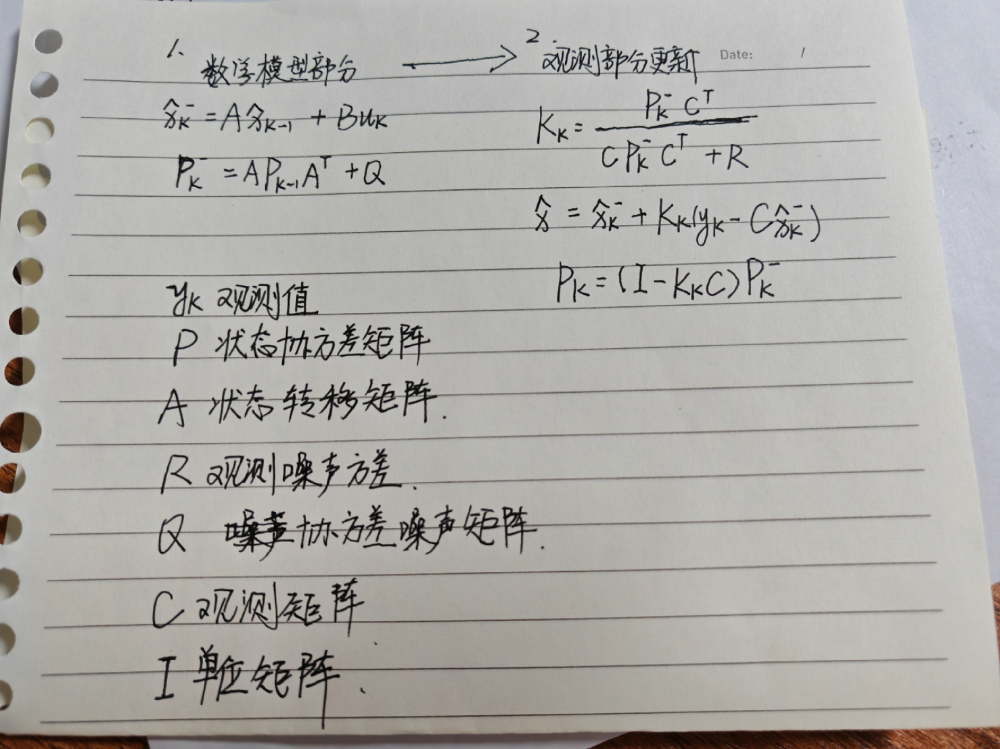

# 卡尔曼滤波

## 一，认识与理解

在目标检测，对目标会有一个观测值和一个预测值，二者均不准确，观测值来源于传感器，不一定准确，预测值来源于数学模型，存在误差。在识别领域，对目标画的框相当于传感器获取的数据。

卡尔曼滤波所要完成的事情就是衡量要相信观测值多一点，还是相信预测值多一点

预测结果服从正态分布

## 二，视频教程

[卡尔曼滤波原理及在MATLAB中的应用_哔哩哔哩_bilibili](https://www.bilibili.com/video/BV1Ah4y1P7iX?p=1&vd_source=4594141505457c253b42d2d2094e4168)

## 三，概念区分

理解并掌握5个公式的用法

**1.观测值和观测矩阵的联系与区别：**

观测值来源于传感器，一个观测值只能描述一个数量信息，而观测矩阵可以将多个数量信息整合到一起，为了后续计算

**2.卡尔曼增益K**

通俗来讲，卡尔曼增益K是一个权重项，描述是相信预测值多一点，还是观测值多一点

目的是为了使结果的正态分布的方差更小

**3.噪声矩阵**

描述不可控的因素对数学模型，和对卡尔曼增益K的影响

**4.协方差矩阵P**

描述不同变量间的相关性，是一个对称矩阵，几个变量就是几维的方阵

例如，a12就是描述变量1和变量2的相关性，对角线上的元素就是各个状态量的方差

初始化时，可以将非对角线上的元素初始化为0，对角线上的元素表示各个状态量的初始方差，通常情况手动调节

## 四，五个公式

</img>